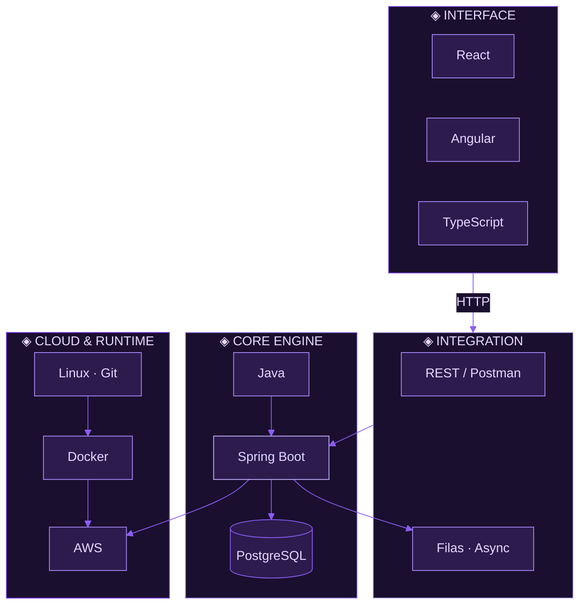

<div align="center">


```text
┏━━━━━━━━━━━━━━━━━━━━━━━━━━━━━━━━━━━━━━━━━━━━━━━━━━━━━━━━━━━━━━━━━━━━━━━━━━━━━━┓
┃                                                                                ┃
```

<table width="100%">
<tr>
<td width="38%" align="center" valign="middle">

```text
  ╭─────────────────────╮
  │                     │
```


```text
  │                     │
  ╰─────────────────────╯
```

</td>
<td width="62%" align="left" valign="middle">

## ✦ KAROL DINIZ


<br/>

<a href="#stack"></a>
<a href="#telemetry"></a>
<a href="#connect"></a>

<br/><br/>

<a href="https://www.linkedin.com/in/karol-diniz-3b1817214"></a>
<a href="https://github.com/KarolDiniz"></a>

</td>
</tr>
</table>

```text
┃                                                                                ┃
┣━━━━━━━━━━━━━━━━━━━━━━━━━━━━━━━━━━━━━━━━━━━━━━━━━━━━━━━━━━━━━━━━━━━━━━━━━━━━━━┫
```

<br/>

<!-- ═══════════════════ STACK ═══════════════════ -->
<a id="stack"></a>


<br/>

```text
  ╔══════════════════════════════════════════════════════════════════════════╗
  ║  LAYER 01 · CORE ENGINE                                                  ║
  ╚══════════════════════════════════════════════════════════════════════════╝
```

<table width="100%">
<tr>
<td align="center">


<br/><br/>


<br/><br/>

<sub>REST APIs · segurança · DI · persistência · migrations · lógica de negócio</sub>

</td>
</tr>
</table>

<br/>

```text
  ╔══════════════════════════════════════════════════════════════════════════╗
  ║  LAYER 02 · CLOUD & RUNTIME                                              ║
  ╚══════════════════════════════════════════════════════════════════════════╝
```

<table width="100%">
<tr>
<td align="center">


<br/><br/>


<br/><br/>

<sub>deploy · containers · CI/CD · certificação AWS · infraestrutura em produção</sub>

</td>
</tr>
</table>

<br/>

<table width="100%">
<tr>
<td width="50%" align="center" valign="top">

```text
  ┌─ LAYER 03 · INTEGRATION ─────────────────┐
  │  REST · Postman · filas · microserviços  │
  └──────────────────────────────────────────┘
```

<br/>


<br/><br/>


</td>
<td width="50%" align="center" valign="top">

```text
  ┌─ LAYER 04 · INTERFACE ───────────────────┐
  │  React · Angular · TypeScript · Python   │
  └──────────────────────────────────────────┘
```

<br/>


<br/><br/>


</td>
</tr>
</table>

<br/>

```text
  ┌─ SYSTEM MAP ─────────────────────────────────────────────────────────────┐
```



```text
  └──────────────────────────────────────────────────────────────────────────┘
```

```text
┣━━━━━━━━━━━━━━━━━━━━━━━━━━━━━━━━━━━━━━━━━━━━━━━━━━━━━━━━━━━━━━━━━━━━━━━━━━━━━━┫
```

<br/>

<!-- ═══════════════════ TELEMETRY ═══════════════════ -->
<a id="telemetry"></a>


<table width="100%">
<tr>
<td width="33%" align="center" valign="middle">

</td>
<td width="33%" align="center" valign="middle">

</td>
<td width="33%" align="center" valign="middle">

</td>
</tr>
</table>


<picture>
  <source media="(prefers-color-scheme: dark)" srcset="https://raw.githubusercontent.com/KarolDiniz/KarolDiniz/output/github-snake-dark.svg">
  
</picture>


```text
┣━━━━━━━━━━━━━━━━━━━━━━━━━━━━━━━━━━━━━━━━━━━━━━━━━━━━━━━━━━━━━━━━━━━━━━━━━━━━━━┫
```

<br/>

<!-- ═══════════════════ CONNECT ═══════════════════ -->
<a id="connect"></a>


<a href="https://www.linkedin.com/in/karol-diniz-3b1817214">
  
</a>

```text
┃                                                                                ┃
┗━━━━━━━━━━━━━━━━━━━━━━━━━━━━━━━━━━━━━━━━━━━━━━━━━━━━━━━━━━━━━━━━━━━━━━━━━━━━━━┛
```


<br/>


</div>
