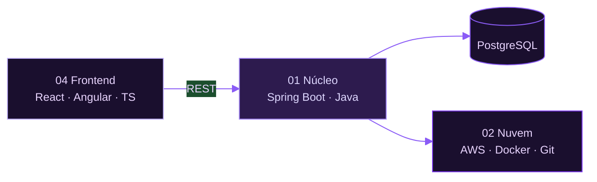

<table width="100%">
<tr>
<td width="36%" align="center" valign="middle">

</td>
<td width="64%" align="left" valign="middle">

<table cellpadding="6" cellspacing="0">
<tr>
<td align="left">

</td>
</tr>
<tr>
<td align="left">

</td>
</tr>
<tr>
<td align="left">

</td>
</tr>
<tr>
<td align="left">

</td>
</tr>
</table>

</td>
</tr>
</table>

<!-- stack -->

<table width="100%" cellpadding="10" cellspacing="0">
<tr>
<td width="50%" align="center" valign="top">

 

 

APIs · regras de negócio · SQL · persistência

</td>
<td width="50%" align="center" valign="top">

 

 

deploy · containers · infra · versionamento

</td>
</tr>
<tr>
<td width="50%" align="center" valign="top">

 

 

REST · testes de API · automação · repos

</td>
<td width="50%" align="center" valign="top">

 

 

interfaces · componentes · tipagem · SPA

</td>
</tr>
</table>

<!-- atividade -->

<table width="100%">
<tr>
<td width="33%" align="center" valign="middle">

</td>
<td width="33%" align="center" valign="middle">

</td>
<td width="33%" align="center" valign="middle">

</td>
</tr>
</table>

<picture>
  <source media="(prefers-color-scheme: dark)" srcset="https://raw.githubusercontent.com/KarolDiniz/KarolDiniz/output/github-snake-dark.svg">
  
</picture>

<!-- contato -->

