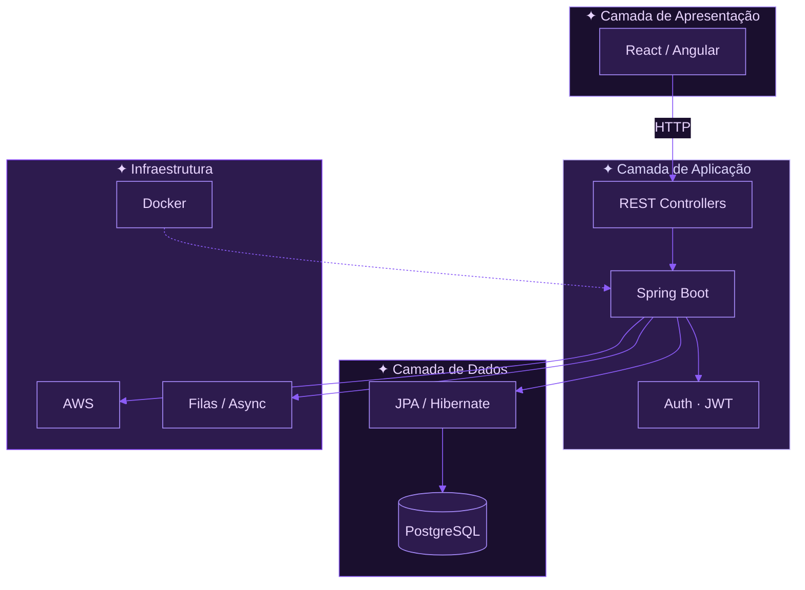

<div align="center">


<a href="#identity"></a>
<a href="#stack"></a>
<a href="#telemetry"></a>
<a href="#connect"></a>


</div>

<!-- ═══════════════════ IDENTITY ═══════════════════ -->
<a id="identity"></a>

<div align="center">

</div>

<table width="100%">
<tr>
<td width="38%" align="center" valign="middle">


```text
╔════════════════════════╗
║  KAROL.DINIZ / PROFILE ║
╠════════════════════════╣
║ Karoline Diniz Ramos   ║
║ Software Engineer      ║
║ AWS Certified          ║
║ Paraíba, Brazil        ║
║ Status: ◉ ONLINE       ║
╚════════════════════════╝
```

<a href="https://www.linkedin.com/in/karol-diniz-3b1817214"></a>
&nbsp;
<a href="https://github.com/KarolDiniz"></a>


</td>
<td width="62%" align="left" valign="middle">

```bash
$ karol.diniz --whoami
────────────────────────────────────────────
  name     │ Karoline Diniz Ramos
  role     │ Software Engineer · Backend
  core     │ Java · Spring Boot · SQL
  cloud    │ AWS · Docker · REST APIs
  also     │ React · Angular · TypeScript
  creds    │ AWS Certified
  from     │ Paraíba → IFPB → Production
  vibe     │ "código limpo, deploy tranquilo"
────────────────────────────────────────────
$ karol.diniz --status
  ▰▰▰▰▰▰▰▰▰▰ 100%  open to connect
```

<p align="left">
Sou engenheira de software focada em <strong>backend</strong>. Entro em sistemas legados, organizo o caos e saio com APIs que alguém consegue manter.<br/>
Java e Spring Boot no centro · SQL como fundação · AWS quando precisa ir pra nuvem.
</p>

<p align="left"><em>“Não construo só features — construo sistemas que ainda funcionam daqui a seis meses.”</em></p>

</td>
</tr>
</table>

<div align="center">


```text
  JAVA         ▰▰▰▰▰▰▰▰▰▱  92%    │    REACT        ▰▰▰▰▰▰▱▱▱▱  68%
  SPRING BOOT  ▰▰▰▰▰▰▰▰▱▱  88%    │    ANGULAR       ▰▰▰▰▰▱▱▱▱▱  62%
  SQL          ▰▰▰▰▰▰▰▰▱▱  85%    │    TYPESCRIPT    ▰▰▰▰▰▰▱▱▱▱  70%
  AWS          ▰▰▰▰▰▰▰▱▱▱  78%    │    PYTHON        ▰▰▰▰▰▱▱▱▱▱  60%
  DOCKER       ▰▰▰▰▰▰▱▱▱▱  72%    │    GIT / LINUX   ▰▰▰▰▰▰▰▰▱▱  86%
```


</div>

<!-- ═══════════════════ STACK ═══════════════════ -->
<a id="stack"></a>

<div align="center">

</div>

<table width="100%">
<tr>
<td width="50%" align="center" valign="top">

**✦ Backend & Dados**


| tech | uso |
|:-----|:----|
| Java | APIs, lógica de negócio, integrações |
| Spring Boot | REST, segurança, camadas, DI |
| PostgreSQL | persistência, queries, modelagem |
| JPA / SQL | ORM, migrations, performance |

</td>
<td width="50%" align="center" valign="top">

**✦ Cloud & DevOps**


| tech | uso |
|:-----|:----|
| AWS | deploy, serviços cloud, certificação |
| Docker | containers, ambientes reproduzíveis |
| Linux | servidores, terminal, pipelines |
| Git | versionamento, PRs, colaboração |

</td>
</tr>
<tr>
<td width="50%" align="center" valign="top">

**✦ Integração & Qualidade**


| tech | uso |
|:-----|:----|
| REST APIs | contratos, integrações entre sistemas |
| Postman | testes de endpoint, documentação |
| Filas / Async | microserviços, processamento assíncrono |
| Testes | validação, confiabilidade em produção |

</td>
<td width="50%" align="center" valign="top">

**✦ Frontend & Extras**


| tech | uso |
|:-----|:----|
| React / Angular | interfaces quando o projeto pede |
| TypeScript / JS | componentes, lógica na ponta |
| Python | scripts, side projects, automação |
| HTML / CSS | layout, protótipos, ajustes visuais |

</td>
</tr>
</table>

<div align="center">




</div>

<!-- ═══════════════════ TELEMETRY ═══════════════════ -->
<a id="telemetry"></a>

<div align="center">


<table width="100%">
<tr>
<td width="33%" align="center" valign="middle">

</td>
<td width="33%" align="center" valign="middle">

</td>
<td width="33%" align="center" valign="middle">

</td>
</tr>
</table>


<picture>
  <source media="(prefers-color-scheme: dark)" srcset="https://raw.githubusercontent.com/KarolDiniz/KarolDiniz/output/github-snake-dark.svg">
  
</picture>


</div>

<!-- ═══════════════════ CONNECT ═══════════════════ -->
<a id="connect"></a>

<div align="center">


<a href="https://www.linkedin.com/in/karol-diniz-3b1817214">
  
</a>


</div>
